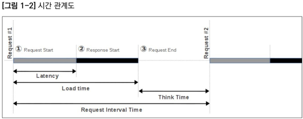

# Performance Testing

## 테스트의 종류

[[Refer] JMeter와 성능 테스트](https://12bme.tistory.com/272)

- Load 테스트: 시스템의 성능을 벤치 마크하기 위한 테스트를 의미합니다. 이 테스트는 부하(Load)를 순차적으로 증가시키면서 응답시간이 급격히 증가하거나 더는 처리량이 증가하지 않거나 시스템의 CPU와 Memory 등이 기준값 이상으로 증가하는 등 비정상 상태가 발생하는 임계점을 찾아내고 이를 바탕으로 성능 이슈에 대한 튜닝과 테스트를 반복합니다.

- Stress 테스트: 임계값 이상의 요청이나 비정상적인 요청을 보내 비정상적인 상황의 처리 상태를 확인하고 시스템의 최고 성능 한계를 측정하기 위한 테스트를 의미합니다.

- Spike 테스트: 이 테스트는 예를 들어 빌딩에 화재 경보가 발생했을 때 빌딩에 있는 직원들이 동시에 안전한 장소를 향해서 이동할 경우 시간이 얼마나 걸리며 어떤 문제가 발생하는지를 테스트하는 것과 같습니다.  
즉, 갑자기 사용자가 몰렸을 때 요청이 정상적으로 처리되는지 그리고 그 업무 부하(Workload)가 줄어들때 정상적으로 반응하지는지를 확인하기 위한 테스트를 의미합니다.

- Stability 테스트 / Soak 테스트: 긴 시간 동안 테스트를 진행해서 테스트 시간에 따른 시스템의 메모리 증가, 성능 정보의 변화 등을 확인하는 테스트를 의미합니다. 짧게는 한두 시간부터 길게는 며칠동안 진행하기도 합니다.

### Stress Test <> Load Test

[[Refer] 부하테스트를-하기위한-2가지-도구](https://velog.io/@groovejumat/%EB%B6%80%ED%95%98%ED%85%8C%EC%8A%A4%ED%8A%B8%EB%A5%BC-%ED%95%98%EA%B8%B0%EC%9C%84%ED%95%9C-2%EA%B0%80%EC%A7%80-%EB%8F%84%EA%B5%AC)

스트레스 테스트

- CPU, RAM, DISK의 환경이 갖추어지지 않은 어플리케이션에 비정상적으로 높은 부하를 발생시켜 한계점을 테스트해보는 것을 말한다.

- 실제로 이러한 부하가 발생시키면 VM서비스의 다운, 데이터의 소실 등의 시스템레벨의 오작동을 유발 시키는 것이 가능하다.

- 이러한 결점과 결함점을 찾는 것을 목표로 스트레스 테스트가 진행되어진다.

- 어디까지나 시스템레벨에서의 결함을 예상하는 수준으로 결과물을 파악하는 것이 중요하며, 실접속자가 발생시키는 부하량과는 매우 다른 케이스를 가질 수도 있다는 점을 유의한다.

부하 테스트

- 적절한 부하를 발생시켜서 통계적으로써 의미있는 수치를 측정한다.

- 장시간의 서비스 진행여부를 확인하는 신뢰성(reliability)

- 실체 처리능력을 가늠하는 성능테스트(Performance)

- "부하"라는 것은 매우 포괄적이므로, 부하테스트에 사용되어지는 부하의 모든 의미를 내포하는 것으로 이해하는 것이 좋다.

## 주요 용어

[[Refer] JMeter와 성능 테스트](https://12bme.tistory.com/272)

- Active User: 실제 서버에 연결된 상태로 요청을 처리 중인 사용자를 말합니다.

- InActive User: 웹브라우저에 결과 화면이 출력된 상태에서 화면의 내용을 읽거나 정보를 입력하고 있는 사용자입니다. 서버와의 세션(Session) 정보를 가지고 있지만 직접 접속하여 요청을 주고받는 상태가 아닌 사용자를 의미합니다.

- Concurrent User(Active User + InActive User): 보통 '동시 접속 사용자수'라고 표현합니다. 일반적으로 사용자 수의 많고 적음을 표현하는 값으로, 성능 테스트에서 가상 사용자 수를 결정하는 기준이 됩니다. 서비스 유형과 시간에 따라 그 비율이 달라지긴 하지만, 일반적으로 Active User와 InActive User 비율이 1:10 정도입니다.

- Virtual User: 가상 사용자 수로, JMeter에서는 Thread 수로 표현하기도 합니다.

- Ramp-Up Period: Thread(Virtual User) 생성에 걸리는 시간을 의미합니다. Ramp-Up Period를 이해하기 쉽도록 작성한 그래프입니다.이 그래프는 '10개의 Thread를 50초 동안 차례대로 생성하라'는 의미입니다. 즉, 5초(50초/10개)마다 Thread를 하나씩 생성하는 것과 같은 의미입니다.

- Throughput: 단위 시간당 대상 서버(웹서버, WAS, DB 등)에서 처리되는 요청의 수를 말합니다. JMeter에서는 시간 단위를 보통 TPS(Transaction Per Second)로 표현합니다.
  - PPS(Page Per Second) : 웹 시스템에서 특정 페이지에 대한 요청.
  - RPS(Request Per Second)
  - TPS(Transaction Per Second) : 데이터베이스의 트랜잭션 기반 시스템에서 사용.
  - BPS(Bits Per Second) : 네트워크의 경우는 초당 비트 수

- Response Time/Load Time: 응답시간 또는 처리시간이라고 표현합니다. 요청을 보낸 후 응답이 완료되어 사용자 화면에 출력될때까지의 시간을 나타냅니다. 시스템의 성능을 평가하는 지표로 주로 사용됩니다.

- Latency: 요청을 보낸 후 데이터를 받기 시작할 때까지 시간입니다.

- Think Time: 하나의 요청에 응답을 수신하고 다음 요청을 보낼 때까지 시간을 의미합니다. 테스트에서 실제 사용자의 사용패턴과 유사한 패턴을 구현하기 위해서는 이 Think Time을 적절히 적용해야 합니다.

- Request Interval Time: 요청을 보낸 후 다음 요청을 보낼때까지 시간을 의미합니다.

- Load Time vs Latency: 아래 그림은 Load Time/Latency/Think Time/Request Interval Time의 관계를 이해하기 쉽도록 그림으로 나타낸 것입니다.

위를 보면 한상 Load Time >= Latency가 성립됩니다. 두 개를 왜 나눠놓았을 까요? 이것은 Latency와 Load Time을 구분함으로써 성능을 분석할 때 요긴하게 사용할 수 있습니다.

> A와 B 사이트에 동일한 크기(10MB 정도)의 파일을 올려놓고 다운로드 테스트를 진행한다고 가정해보겠습니다. A 사이트와 B 사이트의 결과를 비교해 보니 B 사이트의 Load Time이 2배 이상 컸습니다. 하지만 Latency는 거의 비슷했습니다. 이렇게 차이가 나는 이유가 무엇일까요?  
> Load Time에서 Latency를 빼면 데이터를 전송받는데 걸리는 시간을 나타냅니다. 즉, B 사이트가 A 사이트보다 데이터를 내려받는 속도가 느리다고 볼 수 있습니다. 따라서 B 사이트는 처리량을 늘리기 위해 웹서버를 튜닝하기보다는 네트워크의 대역폭(Bandwidth)을 늘리는 것을 고려해야 합니다.

## Mock

[[Refer] 결제 시스템 성능, 부하, 스트레스 테스트](https://techblog.woowahan.com/2572/)

### 성능 테스트시 하지 말아야 할 Mocking

1. 객체 Mocking

객체 Mocking은 테스트 코드를 작성할 때 가장 많이 사용하는 방식이라 친숙할 것 입니다. 그러나 로직에 대해 검증을 하는 테스트와 달리, 성능 테스트는 어플리케이션 동작과 자원의 사용을 모두 보아야만 하는 테스트입니다.

객체 Mocking 은 해당 객체의 행위 뒤로 들어가야 할 동작들을 무시해버리게 됩니다. 예를 들어 Spring Profile 을 사용하여 RestOpertation 을 객체를 Mock 처리하였을 때

- http connection Pool 미사용
- connection thread 미사용
- io가 발생하지 않음

등등 성능 테스트에서 중요한 관점인 Thread 사용, 리소스 사용을 전부 무시하게 됩니다.

외부 인터페이스를 Mocking 하는 것처럼 보이지만, 내부 인터페이스도 Mocking 해버리는 객체 Mocking 은 성능 테스트에서 피해야 합니다.

2. 같은 어플리케이션에 Dummy Controller 생성

이 방식도 아주 간혹 테스트 코드를 작성할 때 사용하는 방식입니다. 이 방식이 1번 방식과 다른 것은 실제로 요청을 보내고 받으며 자원을 사용한다는 것 입니다.

그러나 Dummy Controller 의 로직은 테스트 시스템의 자원과 리소스를 같이 사용해버리게 됩니다. 테스트 대상 시스템이 더 늘어나 버리는 신뢰성이 굉장히 떨어지는 의미없는 성능 테스트를 하게 됩니다. 테스트를 위한 요소는 대상 시스템에 절대로 영향을 미쳐서는 안 됩니다.

### 외부 인터페이스 Mock Server 기준점

테스트 대상 시스템과 완벽히 분리된 Mock Server 를 띄워야 합니다.

외부 인터페이스 Mock이 갖추어야 할 조건을 아래와 같이 정의했습니다.

- 모든 요청에 기대한 결과만을 반환한다.
- 모든 요청에 기대한 퍼포먼스만 낸다.
- 병목이 되지 않아야 한다.
