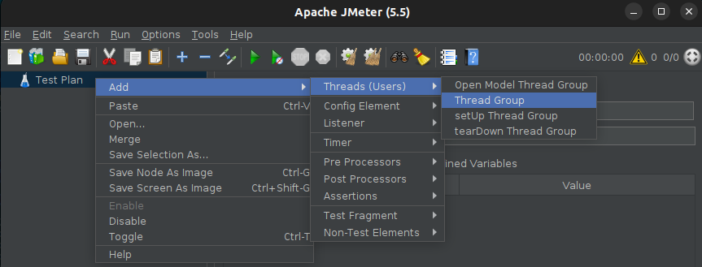
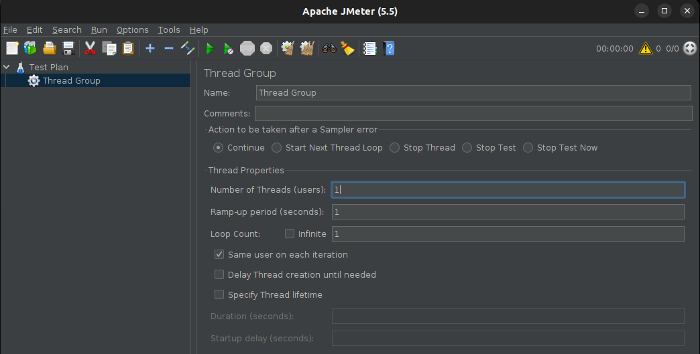
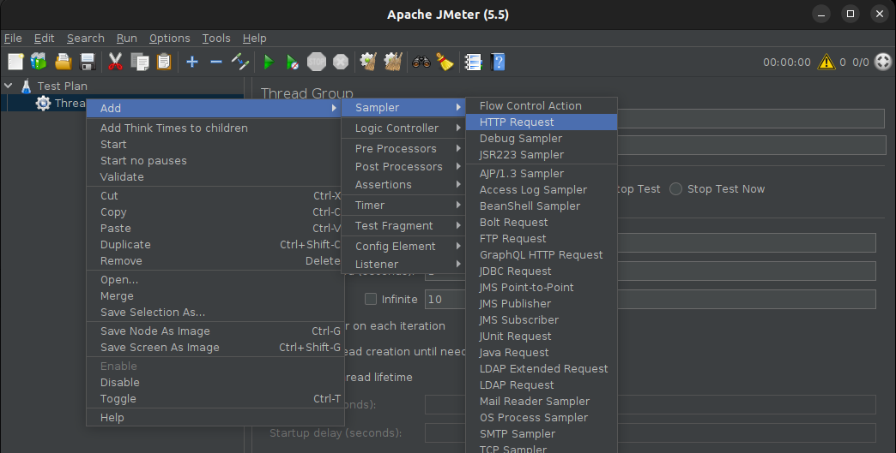
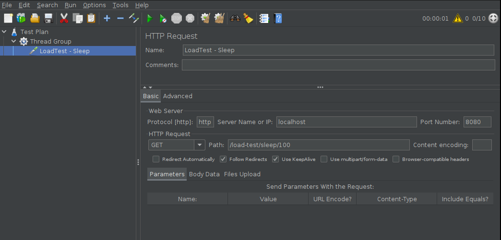

# JMeter

[[Doc] User's Manual](https://jmeter.apache.org/usermanual/index.html)

## Download and Run

[Download Apache JMeter](https://jmeter.apache.org/download_jmeter.cgi)

```bash
$ wget https://dlcdn.apache.org//jmeter/binaries/apache-jmeter-5.5.tgz

$ tar -xvf apache-jmeter-5.5.tgz

$ cd apache-jmeter-5.5/bin

$ ./bin/jmeter.sh
================================================================================
Don't use GUI mode for load testing !, only for Test creation and Test debugging.
For load testing, use CLI Mode (was NON GUI):
   jmeter -n -t [jmx file] -l [results file] -e -o [Path to web report folder]
& increase Java Heap to meet your test requirements:
   Modify current env variable HEAP="-Xms1g -Xmx1g -XX:MaxMetaspaceSize=256m" in the jmeter batch file
Check : https://jmeter.apache.org/usermanual/best-practices.html
================================================================================
```

## Use case - HTTP Request

[[Refer] JMeter 쓰레드 그룹만들기-(2)](https://kamang-it.tistory.com/399)  
[[Refer] Apache Jmeter 설치 및 사용법](https://zz1-hyunn.tistory.com/48)

### 1. Add Thread Group





- Action to be taken after a Sampler error : 샘플러가 에러시에 취할 행동이다. 사실 보통 Continue를 두면 에러와 무관하게 루프를 돌게된다.  
만약 다른 행동을 취하고 싶다면 해도된다.

- Number of Threads : 쓰레드를 동시에 몇개 생성할지이다. 즉 동시에 몇개의 트랜잭션을 실행시킬지이다.  
이는 사람이 동시에 접속하는 효과를 낸다. 10명이서 동시에 접속하는 상황을 만들고 싶다면 10을 사용하면된다.

- Ramp-Up Period : 쓰레드를 Ramp-Up Period시간동안 실행해라는 의미이다. 단 균등하게 시간을 나눠서 실행하려고 노력한다.  
예를 들어 Number of Threads가 10인데 Ramp-Up Period가 60이면 10개의 쓰레드가 6초간격으로 동작하려고 한다. 근데 그렇게 안될 수도 있다.  

- Loop Count : 스레드의 반복 횟수를 의미한다. 10이면 10번 반복한다.  
Infinite에 체크하면 무한 반복한다.

- Delay Thread creation until needed : 스레드의 생성을 필요할 때까지 기다린다.  
체크를 해제하면 안기다리고 날리는데 반응성은 더 좋아지긴 하는데 안정성을 위해서 체크해 두자.

- Scheduler : 위의 모든 작업을 스케줄화 해서 할 수 있다.

- Duration : Scheduler를 체크했을때만 사용가능. Thread Properties의 총작업을 하는 시간을 의미한다.  
예를들어 100초를 정하면 위의 작업을 딱 100초동안 실행한다. 100초안에 걸리는 작업이면 조기에 정지되지만 위의 작업이 100초를 넘어간다면 더이상 실행하지 않고 멈춘다.

- Startup delay : 위의 작업을 실행하기 위한 유예기간을 의미한다. 쓰레드 그룹이 한개일때는 별 필요없지만 쓰레드 그룹을 여러개 돌릴떄는 서로 차등을 줄 수 있다.

### 2. Create HTTP Request




